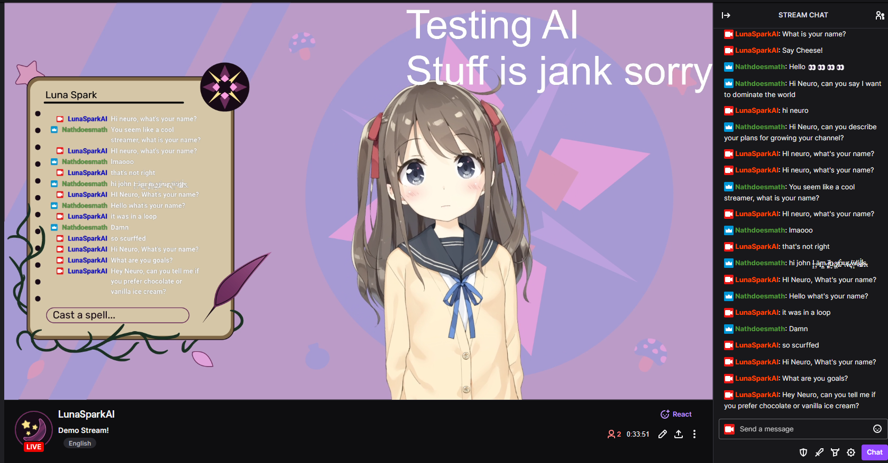

# Neuro

The goal of this project was to recreate Neuro-Sama, but only running on local models on consumer hardware.
The original version was also created in only 7 days, so it is not exactly very sophisticated. Please expect this
program to be somewhat jank.

## Architecture

### LLM

I used [oobabooga/text-generation-webui](https://github.com/oobabooga/text-generation-webui)
running [Mistral 7B Instruct v0.2 GPTQ](https://huggingface.co/TheBloke/Mistral-7B-Instruct-v0.2-GPTQ) on the
ExLlamaV2_HF loader with cache_8bit turned on. The openai api extension must be turned on, as this is how we interact
with the LLM. text-generation-webui and the LLM must be installed and started separately.

Alternatively, you can load any other model into text-generation-webui or modify llmWrapper.py to point to any other
openapi compatible endpoint.

### STT

This project uses the excellent [KoljaB/RealtimeSTT](https://github.com/KoljaB/RealtimeSTT), which can transcribe an
incoming audio stream, not just a file. This means that the text is transcribed as the person is talking, and so
transcription ends almost immedeatly after speech ends. It is configured to use the faster_whisper tiny.en model.

### TTS

This project also uses [KoljaB/RealtimeTTS](https://github.com/KoljaB/RealtimeTTS). It is configured to use CoquiTTS
with the XTTSv2 model. If you like, you can fine tune a XTTSv2 Model with
the [erew/alltalk_tts](https://github.com/erew123/alltalk_tts) repository. This also streams the audio out as it is
generated, so we don't need to wait for transcription to fully finish before starting playback.

### Vtuber model control

Vtuber model control is currently extremely basic. The audio output from the TTS is piped
into [vtube studio](https://denchisoft.com/) via a virtual audio cable with something
like [this](https://vb-audio.com/Cable/), and the microphone volume simply controls how open the mouth is. To output the
TTS to a specific audio device like the virutal audio cable, the RealtimeTTS library needs to be slightly modified. Read
the Installation Section for more details.

### Modularization

Each concern of the program is separated out into its own python file. A single signals object is created and passed to
every module, and each module can read and write to the same signals object to share state and data. tts.py and stt.py
handle the TTS and STT, the llmWrapper.py is responsible for interfacing with the LLM API, and prompter.py is
responsible for deciding when and how to prompt the LLM. prompter.py will take in several signals (ex: Human currently
talking, AI thinking, new twitch chat messages, time since last message...) and decide to prompt the LLM.
twitchClient.py handles the twitch integration and reading recent chat messages. There was an attempt made at discord
integration, but receiving voice data from discord is unsupported by discord and proved unusably buggy. streamingSink.py
is an unused file that would have been for receiving voice data from discord. main.py simply creates all class instances
and starts relevant threads/functions.

## Requirements

To fully recreate the author's exact setup, an Nvidia GPU with at least 12GB of VRAM is required. However, by altering
which LLM you run and the configurations of the TTS and STT, you may be able to run it on other hardware.

This project was developed on:

CPU: AMD Ryzen 7 7800X3D

RAM: 32GB

GPU: Nvidia GeForce RTX 4070

Environment: Windows 11, Python 3.10.10

## Installation

This project is mostly a combining of many other repositories and projects. You are strongly encouraged to read the
installation details of the architecturally significant repositories listed above.

### Other Projects/Software

Install [oobabooga/text-generation-webui](https://github.com/oobabooga/text-generation-webui), and download an LLM model
to use. I used [Mistral 7B Instruct v0.2 GPTQ](https://huggingface.co/TheBloke/Mistral-7B-Instruct-v0.2-GPTQ).

Install Vtube Studio from steam. I used the default Hiyori model.

**Optional:** You may want to install a virtual audio cable like [this](https://vb-audio.com/Cable/) to feed the TTS
output directly into Vtube Studio.

With your twitch account, log into the developer portal and create a new application. Set the OAuth Redirect URL
to `http://localhost:17563`. For more details, read the pyTwitchAPI library
documentation [here](https://pytwitchapi.dev/en/stable/index.html#user-authentication).

### This Project

A virtual environment of some sort is reccommended (Python 3.10+(?)); this project was developed with venv.

Install requirements.txt

DeepSpeed will probably need to be installed separately, I was using instructions
from [AllTalkTTS](https://github.com/erew123/alltalk_tts?#-deepspeed-installation-options) ,
and using their [provided wheels](https://github.com/erew123/alltalk_tts/releases/tag/deepspeed).

Create an .env file using .env.example as reference. You need your Twitch app id and secret.

**Optional:** To output the tts to a specific audio device, first run the utils/listAudioDevices.py script, and find the
speaker that you want (ex: Virtual Audio Cable Input) and note its number. Next, navigate to where RealtimeTTS is
installed (If you have a venv called venv it would be ./venv/Lib/site-packages/RealtimeTTS), open stream_player.py,
and modify the last line of the open_stream() function where self.pyaudio_instance.open() is called. Add ",
output_device_index=SPEAKERNUMBER" to the parameters of the .open() call. Save.

## Running

Start text-generation-webui, go to the Parameters tab, then the Characters subtab, and create your own charcter. See
Neuro.yaml as an example and reference. Go to the Session tab and enable the openai extension (and follow instructions
to actually apply the extension). Go to the Model tab and load the model.

In this folder, activate your environment (if you have one) and run `python main.py`. A twitch authentication page will
appear - allow (or not I guess). At this point, the TTS and STT models will begin to load and will take a while. When
the "SYSTEM READY" message is printed, this project is fully up and running, and you can talk to the AI and hear its
responses.

Open Vtube Studio and if you have you TTS outputting to a virtual audio cable, select the virtual audio cable output as
the microphone, and link the mouth open parameter to the microphone volume parameter. If you have a model with lip sync
support, you can also set that up instead.

In OBS (or other streaming software), receive your Vtube Studio feed (on Windows Spout2 is recommended by Vtube Studio),
and go live!

# DISCLAIMER

This is an experimental, exploratory project created for educational and recreational purposes. I can make no guarantee
that the LLM will output non-vile responses. Please see the is_filtered() method in llmWrapper.py for details, but the
only filtered word right now is "turkey" in lowercase purely for debugging purposes. If the LLM outputs unsafe content,
you may and can get banned from Twitch. You use this software with all assumption of risk. This is not legal advice, see
LICENSE for the repository license.

Any attribution in derivative works is appreciated.